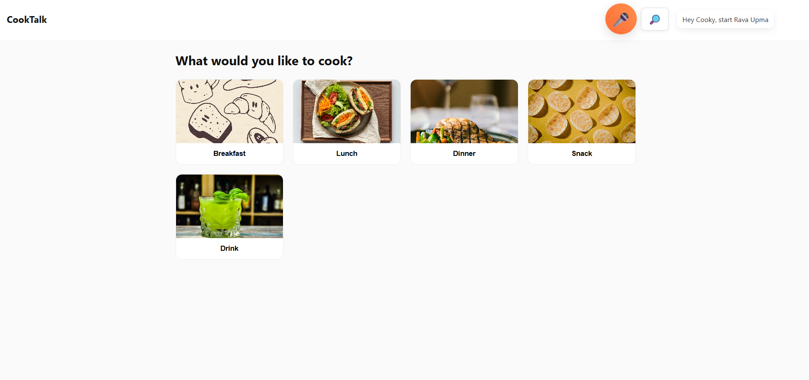
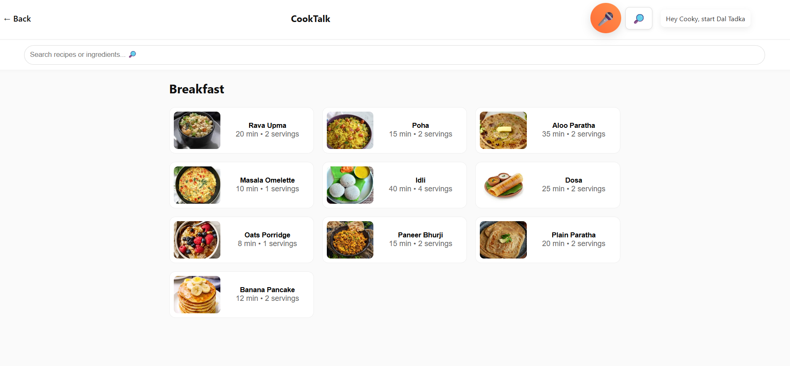

🍳 CookTalk - A Voice-Powered Recipe Assistant

CookTalk is a web-based recipe assistant that works through voice commands.
Users can search recipes, hear ingredients, start step-by-step cooking instructions, set timers, and even navigate recipe categories - without touching the screen.

It feels like talking to a mini cooking assistant named “Cooky” 😄.

🚀 Features
🎤 Full Voice Assistant (Cooky)

You can say:

“Hey Cooky, search upma”

“Hey Cooky, ingredients for poha”

“Hey Cooky, start Rava Upma”

“Hey Cooky, next”

“Hey Cooky, show snacks”

“Hey Cooky, set timer 1 minute”

Cooky listens continuously once activated and responds naturally.

📦 Recipe Categories

Breakfast

Lunch

Dinner

Snacks

Drinks

Each category loads clean recipe cards with images, time, and servings.

📑 Recipe Details

Every recipe shows:

High-quality image

Ingredients list

Step-by-step cooking method

Start Making (voice-guided cooking)

🔍 Smart Search

Search works in two places:

Top search bar

Search modal
Supports:

Recipe name

Ingredient search

Voice-activated search

🛠️ Tech Stack

HTML5

CSS3

JavaScript (Vanilla)

Web Speech API
(SpeechRecognition + SpeechSynthesis)

LocalStorage

Netlify + GitHub Pages deployment

💡 Development Journey - My Real Experience

This section explains how the project was built and the problems solved along the way.
Very important for anyone reviewing the project.

🧩 1. Structuring the Website

Initially, I created the basic 3 pages:

index.html
recipes.html
details.html

Then added folders:

/assets/images
/css
/js

Problem I faced:

Images were not loading when I started filling recipes.

How I fixed it:

I learned that:
👉 The image MUST exist in the same folder path mentioned in recipes.js.

So I placed images inside:

assets/images/...

Then everything worked.

🎤 2. Building the Voice Assistant (Cooky)

This was the most challenging and fun part.

Problems I faced & How I solved them:
❌ Problem 1: Cooky was not listening continuously

Initially the microphone stopped after 1 command.

✔ Fix:

I added recognition.onend to restart listening:

recognition.onend = () => {
  if(listening){
    setTimeout(()=>recognition.start(), 200);
  }
};

❌ Problem 2: “Ingredients for upma” only spoke the LAST ingredient

This happened because all speak() calls overlapped.

✔ Fix:

I added delays:

let delay = 500;
r.ingredients.forEach(i => {
  setTimeout(() => speak(i), delay);
  delay += 1200;
});

Now Cooky reads ingredients one after another, naturally.

❌ Problem 3: Saying “ingredients for upma” opened the search bar

This was happening due to app.js automatically opening search for any voice text containing “search”.

✔ Fix:

I updated the logic:

if(t.includes("ingredients for")) return; // do NOT open search

Now ingredients work perfectly without triggering search modal.

❌ Problem 4: “Show breakfast/snack/dinner” was not working

Cooky detected the command but UI was not switching category.

✔ Fix:

I added category mapping:

const valid = {
  "breakfast":"breakfast",
  "lunch":"lunch",
  "dinner":"dinner",
  "snacks":"snacks",
  "snack":"snacks",
  "drinks":"drinks",
  "drink":"drinks"
};

And then navigation:

localStorage.setItem("cooktalk_selectedCategory", valid[cat]);
window.location.href = "recipes.html";

Now Cooky can open categories instantly.

❌ Problem 5: Cooky required “Hey Cooky” before every command

I wanted it to feel natural — say "Hey Cooky" once and then continue.

✔ Fix:

I added a state:

let cookyActive = false;

Once user says wake word, Cooky stays active.

🔧 3. Deployment Issues (Netlify + GitHub Pages)
First Deployment (Netlify)

I zipped my entire folder.

Uploaded to Netlify.

Netlify instantly deployed with a live link.

Problems I faced:

❌ Zip was wrong — included nested folder
❌ Deployment showed blank page initially

Fix:

I zipped only the inside contents, not the parent folder.

GitHub Deployment

Steps I used:

git init
git add .
git commit -m "Initial commit"
git branch -M main
git remote add origin https://github.com/vridhi24/Cook-Talk.git
git push -u origin main

Then in GitHub Pages settings:

Branch: main

Folder: / (root)

Live link:
👉 https://vridhi24.github.io/Cook-Talk/

📸 Screenshots (Add yours below)

## 📸 Screenshots & Demo

### 🏠 Homepage

### 📄 Recipes Page

## 🎤 Voice Assistant Demo  

🎯 Conclusion

I built CookTalk as a fully functional voice-based cooking assistant.
During the development:

I learned Web Speech API deeply

Solved many real problems around event timing

Understood deployment workflows

Created a smooth voice-UI experience

This project improved both my JavaScript and debugging skills majorly.

🙌 Credits

Made with ❤️ by Vridhi
Voice assistant lovingly named Cooky 🍽️🎤
